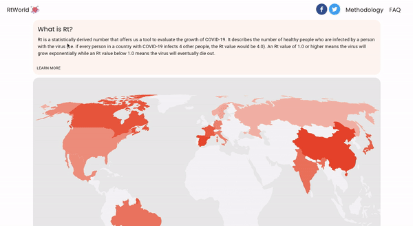

RtWorld provides an estimate for the COVID-19 Rt Value for various countries across the globe. Rt is a statistically derived number that offers us a tool to evaluate the growth of COVID-19. It describes the number of healthy people who are infected by a person with the virus (i.e. if every person in a country with COVID-19 infects 4 other people, the Rt value would be 4.0). An Rt value of 1.0 or higher means the virus will grow exponentially while an Rt value below 1.0 means the virus will eventually die out.

